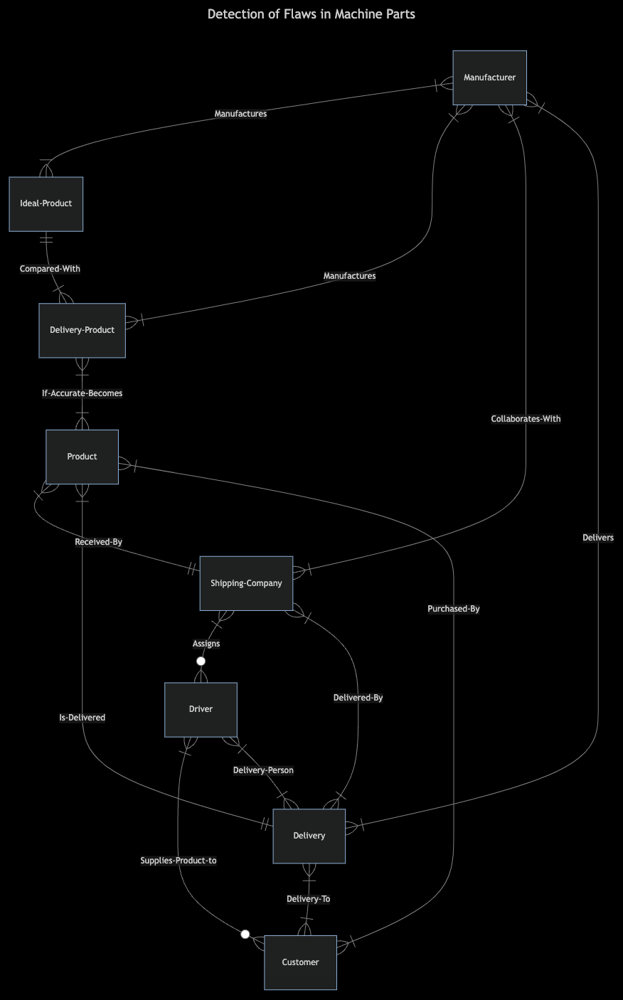

# Detection Of Flaws in Machine Parts
## Video Overview: https://youtu.be/J6RFjSq9tPw
This document describes the design and structure of the database for managing data of products that have been manufactured by companies.
Sometimes products have mechanical defects after they have been manufactures so this database keeps track of defective products when compared
with their ideal versions provided by the same manufacturer and also tracks how the final product is delivered to the customers by the shipping
companies consisting of information of drivers. This database could be useful in analysing defects and give insights that where to improve.

## Tables
### Manufacturer
The Manufacturer table stores information about product manufacturers.
- ID: INTEGER, Primary Key
- Name: TEXT, NOT NULL
- City: TEXT, NOT NULL
- State: TEXT, NOT NULL
- Country: TEXT, NOT NULL
- Establishing Year: INTEGER, NOT NULL
- Rating: NUMERIC, NOT NULL, CHECK (Rating >= 0)

### Ideal_Product
The Ideal_Product table stores information about the idealized specifications of products.
- ID: INTEGER, Primary Key
- Name: TEXT, NOT NULL
- Price Per Unit: NUMERIC, NOT NULL, CHECK (Price Per Unit > 0)
- Manufacturer ID: INTEGER, NOT NULL, Foreign Key (references Manufacturer(ID))
- Manufacturing Date: TIMESTAMP, NOT NULL, DEFAULT CURRENT_TIMESTAMP
- Material Used: TEXT, NOT NULL
- Weight: NUMERIC, NOT NULL, CHECK (Weight > 0)
- Dimensions: TEXT, NOT NULL
- Density: NUMERIC, NOT NULL, CHECK (Density > 0)

### Delivery_Product
The Delivery_Product table stores information about actual delivered products.
- ID: INTEGER, Primary Key
- Name: TEXT, NOT NULL
- Price Per Unit: NUMERIC, NOT NULL, CHECK (Price Per Unit > 0)
- Manufacturer ID: INTEGER, NOT NULL, Foreign Key (references Manufacturer(ID))
- Manufacturing Date: TIMESTAMP, NOT NULL, DEFAULT CURRENT_TIMESTAMP
- Material Used: TEXT, NOT NULL
- Weight: NUMERIC, NOT NULL, CHECK (Weight > 0)
- Dimensions: TEXT, NOT NULL
- Density: NUMERIC, NOT NULL, CHECK (Density > 0)
- Accuracy Results: NUMERIC, NOT NULL

### Product
The Product table stores information about products available for sale.
-ID: INTEGER, Primary Key
-Name: TEXT, NOT NULL
-Price Per Unit: NUMERIC, NOT NULL, CHECK (Price Per Unit > 0)
-Manufacturer ID: INTEGER, NOT NULL, Foreign Key (references Manufacturer(ID))
-Delivered Product: INTEGER, NOT NULL, UNIQUE, Foreign Key (references Delivery_Product(ID))
-Manufacturing Date: TIMESTAMP, NOT NULL, DEFAULT CURRENT_TIMESTAMP
-Material Used: TEXT, NOT NULL
-Weight: NUMERIC, NOT NULL, CHECK (Weight > 0)
-Dimensions: TEXT, NOT NULL
-Density: NUMERIC, NOT NULL, CHECK (Density > 0)

### Shipping_Company
The Shipping_Company table stores information about companies responsible for shipping products.
-ID: INTEGER, Primary Key
-Name: TEXT, NOT NULL
-City: TEXT, NOT NULL
-State: TEXT, NOT NULL
-Country: TEXT, NOT NULL
-Establishing Year: INTEGER, NOT NULL
-Number of Drivers: INTEGER, NOT NULL
-Rating: INTEGER, NOT NULL, CHECK (Rating >= 0)

### Driver
The Driver table stores information about drivers working for shipping companies.
-ID: INTEGER, Primary Key
-Name: TEXT, NOT NULL
-Age: INTEGER, NOT NULL, CHECK (Age > 18)
-Salary: NUMERIC
-Driving License Number: TEXT, NOT NULL, UNIQUE
-Working For: INTEGER, NOT NULL, Foreign Key (references Shipping_Company(ID))
-Vehicle Type: TEXT, NOT NULL
-Insurance Policy Number: TEXT, NOT NULL, UNIQUE
-Marital Status: TEXT, CHECK (Marital Status IN ('Yes', 'No', ''))
-City: TEXT, NOT NULL
-State: TEXT, NOT NULL
-Country: TEXT, NOT NULL
-Rating: NUMERIC, NOT NULL, CHECK (Rating >= 0)

### Delivery
The Delivery table stores information about product deliveries.
-ID: INTEGER, Primary Key
-Product ID: INTEGER, NOT NULL, UNIQUE, Foreign Key (references Product(ID))
-Manufacturer ID: INTEGER, NOT NULL, UNIQUE, Foreign Key (references Manufacturer(ID))
-Driver ID: INTEGER, NOT NULL, UNIQUE, Foreign Key (references Driver(ID))
-Shipping Company ID: INTEGER, NOT NULL, UNIQUE, Foreign Key (references Shipping_Company(ID))
-Customer ID: INTEGER, NOT NULL, UNIQUE, Foreign Key (references Customer(ID))
-Delivery Departure Date: TIMESTAMP, NOT NULL
-Delivery Receiving Date: TIMESTAMP, NOT NULL

### Customer
The Customer table stores information about customers who purchase products.
-ID: INTEGER, Primary Key
-Name: TEXT, NOT NULL
-Age: INTEGER, CHECK (Age > 0)
-City: TEXT, NOT NULL
-State: TEXT, NOT NULL
-Country: TEXT, NOT NULL
-Purchased Product ID: INTEGER, NOT NULL, UNIQUE, Foreign Key (references Product(ID))
-Delivery Man ID: INTEGER, NOT NULL, UNIQUE, Foreign Key (references Driver(ID))
-Delivery ID: INTEGER, NOT NULL, UNIQUE, Foreign Key (references Delivery(ID))

## Optimization
### Indexes
- Manufacturer_Index
- Shipper_Index
- Product_Index
- Customer_Index
- Driver_Index

## Relationships
We can see this in the ER Diagram below:-

1. Each Manufacturer can produce multiple Ideal_Product and Delivery_Product.
2. Each Delivery_Product and Ideal_Product is linked to a Manufacturer.
3. Each Product is linked to a Manufacturer and a Delivery_Product.
4. Each Driver works for a Shipping_Company.
5. Each Delivery links a Product, Manufacturer, Driver, Shipping_Company, and Customer.
6. Each Customer is linked to a Product, Driver, and Delivery.

## Notes
1. Ensured that foreign key constraints are satisfied by inserting data into tables in the correct order.
2. Included default values for timestamps to manage dates automatically.
3. Used unique constraints to maintain data integrity for certain relationships.
